# Coda Family Tree

A modern, interactive family tree visualization built with Next.js and Mermaid.js. This project renders family relationships in a clean, zoomable interface with dark mode support.

## 🛠️ I Learned

- [Next.js 15](https://nextjs.org/) - React framework
- [TypeScript](https://www.typescriptlang.org/) - Type safety
- [Tailwind CSS](https://tailwindcss.com/) - Styling
- [Mermaid.js](https://mermaid.js.org/) - Diagram rendering
- [React Zoom Pan Pinch](https://github.com/prc5/react-zoom-pan-pinch) - Interactive controls
- [Vercel Analytics](https://vercel.com/analytics) - Usage tracking

## 🏗️ Local Development

1. Clone the repository:

```bash
git clone https://github.com/yourusername/codafamilytree.git
cd codafamilytree
```

2. Install dependencies:

```bash
pnpm install
```

3. Start the development server:

```bash
pnpm dev
```

4. Open [http://localhost:3000](http://localhost:3000) in your browser

## 📝 Project Structure

```
src/
├── app/
│   ├── components/
│   │   ├── MermaidDiagram.tsx    # Mermaid rendering component
│   │   └── theme-provider.tsx    # Dark mode provider
│   ├── globals.css              # Global styles
│   ├── layout.tsx              # Root layout
│   └── page.tsx               # Main page
├── styles/                    # Additional styles
└── lib/                      # Utility functions
```

## 📄 License

This project is licensed under the MIT License - see the [LICENSE](LICENSE) file for details.

# Coda Family Tree Notes

## 1. ✅ Project Setup (Completed)

#### Initial Setup

- Created Next.js app with TypeScript and Tailwind
- Configured ESLint and TypeScript
- Set up project structure

#### Dependencies Installed

```
```json
{
  "dependencies": {
    "mermaid": "^11.4.0",
    "next": "15.0.3",
    "next-themes": "^0.4.3",
    "react-zoom-pan-pinch": "^3.6.1",
    "@vercel/analytics": "^1.4.0"
  }
}
```

## 2. ✅ Core Development (Completed)

#### Components Created

- MermaidDiagram component for rendering family trees
- Theme provider for dark mode support
- Root Layout

#### Styling

- Implemented Tailwind CSS
- Added dark mode support
- White-board-excalidraw-type-feel

## 3. ✅ Deployment (Completed)

- Repository pushed to GitHub
- Deployed to Vercel
- [ ] Analytics / Data collection

## 4. 🚧 Possible Improvements


##### Family stuff: 

- [ ] Get ages, and pictures (maybe as a submission) 

##### Other stuff

- [ ] Add search 
- [ ] details panel
- [ ] Add export 
- [ ] Image uploading

#### SEO & Analytics

- [ ] Add meta tags
- [ ] Implement OpenGraph images
- [ ] Set up custom analytics events

## Learning Resources

#### React & Next.js

- [Next.js Documentation](https://nextjs.org/docs)
- [React Documentation](https://react.dev/)
- [TypeScript Handbook](https://www.typescriptlang.org/docs/)

#### Related Technologies

- [Mermaid.js Documentation](https://mermaid.js.org/)
- [Tailwind CSS Documentation](https://tailwindcss.com/docs)
- [Vercel Documentation](https://vercel.com/docs)

## Commands Reference

#### Development

```bash
pnpm dev         # Start development server
pnpm build       # Build for production
pnpm start       # Start production server
pnpm lint        # Run linting
```

#### Deployment

```bash
git add .
git commit -m "description"
git push         # Vercel will auto-deploy
```

---

```mermaid
---
config:
  theme: dark
  look: classic
  layout: fixed
---
flowchart TD
  subgraph MakdesiChildren["Makdesi Family"]
    Besma["Besma"]
    Sarmad["Sarmad"]
    Mazen["Mazen"]
    Nithal["Nithal"]
    Moiad["Moiad"]
    Khalid-AKA-Jerry["Khalid-AKA-Jerry"]
    Nisreen["Nisreen"]
    Nawal["Nawal"]
  end
  subgraph CodaChildren["Coda Family"]
    Rawayda["Rawayda"]
    Rita["Rita"]
    Ronda["Ronda"]
    Rafa["Rafa"]
    Rami["Rami"]
    Raymond["Raymond"]
    Rafael["Rafael"]
    Riath["Riath"]
  end
  subgraph MainFamily["THE *Coda* Family"]
    direction LR
    EdmundSargonPeter["EdmundSargonPeter"]
    Ares["Ares"]
    Nora["Nora"]
  end
  subgraph Sarmad'sFamily["Sarmad's Kids"]
    direction LR
    Brandon["Brandon"]
    Ryan["Ryan"]
    Emma["Emma"]
  end
  subgraph Mazin's_Family["Mazin's Kids"]
    direction LR
    Gina["Gina"]
    Maryan["Marianne"]
    Angela["Angela"]
    Luke["Luke"]
  end
  subgraph Makdesi_Family["Moiad's Kids"]
    Lena["Lena"]
    Chris["Chris"]
    Patrick["Patrick"]
  end
  subgraph Shaia_Family["lena's Kids"]
    Alyssa["Alyssa"]
    Gianna["Gianna"]
    Liam["Liam"]
  end
  subgraph NawalFamily["The Alkatib's"]
    Rene["Renee"]
    Monique["Monique"]
    Diana["Diana"]
    Rhonda["Rhonda"]
  end
  subgraph MOMO["Yacoub's"]
    direction LR
    Nathan["Nathan"]
    Alexander["Alexander"]
  end
  subgraph Romaya_Fam["Romaya's"]
    direction LR
    Sofia["Sofia"]
    Dalia["Dalia"]
    Mia["Mia"]
    Rita.["Rita"]
  end
  subgraph Younan_Fam["Younan's"]
    direction LR
    cici["Celine"]
    Julian["Julian"]
    Preston["Preston"]
  end
  subgraph triplets["Triplets"]
    Allison["Allison"]
    Lauren["Lauren"]
    Dylan["Dylan"]
  end
  subgraph Jouni["Jouni Family"]
    Danny["Danny"]
    David["David"]
    triplets
  end
  subgraph Hanna["The One and Only"]
    Natalie((("Natalie")))
  end
  subgraph RamiFamily["Coda's"]
    direction LR
    Anna["Anna"]
    Angelina["Angelina"]
  end
  subgraph RaymondFamily["RefEt Coda's"]
    Andrew["Andrew"]
    Sarah["Sarah"]
  end
  subgraph RafaelFamily["RefAtt Coda's"]
    direction LR
    Alvin["Alvin"]
    Rosie["Rosie"]
    Aila["Aila"]
  end
  subgraph RawaydaFamily["Coda's"]
    Rafel["Rafel"]
    Sadda["Sadda"]
  end
  subgraph Rafel_Fam["Coda's"]
    Reagen["Reagen"]
    Royal["Royal"]
    Roman["Roman"]
    Sophia["Sophia"]
  end
  subgraph RitaFamily["Glina's"]
    Alen["Alen"]
    Tara["Tara"]
  end
  subgraph Glina["Glina's"]
    Clara["Clara"]
    Thomas["Thomas"]
    Ben["Ben"]
  end
  subgraph RondaFamily["Ronda's kids"]
    Nibras["Nibras"]
    Febras["Firas"]
  end
  MakdesiGP(("Gido Poulus + Nana Mary")) ===> MakdesiChildren
  CodaGP(("Gido Edmoond + Nana Salha")) ===> CodaChildren
  Besma == 🔥 ==> MainFamily
  Riath == 🦚 ==> MainFamily
  Sarmad -- 💍💍💍💍💍💍💍💍<br>Sarmad &amp; Saba Makdesi<br>💍💍💍💍💍💍💍💍 ---> Sarmad'sFamily
  Mazen -- 💍💍💍💍💍💍💍💍<br>Mazen &amp; Linda Makdesi<br>💍💍💍💍💍💍💍💍 ---> Mazin's_Family
  Moiad -- 💍💍💍💍💍💍💍💍<br>Moiad &amp; Neda Makdesi<br>💍💍💍💍💍💍💍💍 ---> Makdesi_Family
  Lena -- 💍💍💍💍💍💍💍<br>Randy &amp; Lena Shaia<br>💍💍💍💍💍💍💍 ----> Shaia_Family
  Nawal -- 💍💍💍💍💍💍💍<br> Adil &amp; Nawal Alkatib<br>💍💍💍💍💍💍💍 ---> NawalFamily
  Monique -- 💍💍💍💍💍💍💍💍<br> Lenny &amp; Monique Yacoub<br>💍💍💍💍💍💍💍💍 ----> MOMO
  Diana -- 💍💍💍💍💍💍💍💍<br> Sinan &amp; Diana Romaya<br>💍💍💍💍💍💍💍💍 ----> Romaya_Fam
  Rhonda -- 💍💍💍💍💍💍💍💍<br> Sal &amp; Rhonda Younan<br>💍💍💍💍💍💍💍💍 ----> Younan_Fam
  Nisreen -- 💍💍💍💍💍💍💍💍<br> Majid &amp; Nisreen Jouni<br>💍💍💍💍💍💍💍💍 ---> Jouni
  Nithal -- 💍💍💍💍💍💍💍<br> Imad &amp; Nithal Hanna<br>💍💍💍💍💍💍💍 ---> Hanna
  Rami -- 💍💍💍💍💍💍💍💍<br> Rami &amp; Rasha Coda<br>💍💍💍💍💍💍💍💍 ---> RamiFamily
  Raymond -- 💍💍💍💍💍💍💍<br> Refet &amp; Nehla Coda<br>💍💍💍💍💍💍💍 ---> RaymondFamily
  Rafael -- 💍💍💍💍💍💍💍<br> Rafael &amp;Rena Coda<br>💍💍💍💍💍💍💍 ---> RafaelFamily
  Rawayda -- 💍💍💍💍💍💍💍💍<br> Salah &amp; Rawayda Coda<br>💍💍💍💍💍💍💍💍 ---> RawaydaFamily
  Rafel -- 💍💍💍💍💍💍<br> Rafel &amp; D Coda<br>💍💍💍💍💍💍 ----> Rafel_Fam
  Rita -- 💍💍💍💍💍💍💍<br> Jonny &amp; Rita Glina<br>💍💍💍💍💍💍💍 ---> RitaFamily
  Alen -- 💍💍💍💍💍💍<br> Alen &amp; Katie Glina<br>💍💍💍💍💍💍 ----> Glina
  Ronda -- 💍💍💍💍💍💍<br> Thomas &amp; Ronda <br>💍💍💍💍💍💍 ---> RondaFamily
  Rafa -- 💍💍💍💍💍💍💍💍<br> Hathem &amp; Rafa Yacoub<br>💍💍💍💍💍💍💍💍 ---> RafaFamily((("RafaFamily")))
  style triplets fill:#FFD600,color:#000000
  style Natalie stroke:#ff99ff
  style MakdesiChildren fill:#ff1919,stroke:#000,stroke-width:3px
  style CodaChildren fill:#2196F3,stroke:#000,stroke-width:3px
  style MainFamily fill:#9C27B0,stroke:#000,stroke-width:3px
  style Sarmad'sFamily fill:#D50000
  style Mazin's_Family fill:#000000
  style Makdesi_Family fill:#2962FF
  style NawalFamily fill:#FF6D00,stroke:#000,stroke-width:3px
  style Jouni fill:#00C853
  style Hanna fill:#AA00FF
  style RamiFamily fill:#00C853
  style RaymondFamily fill:#2196F3
  style RafaelFamily fill:#2962FF
  style RawaydaFamily fill:#2196F3
  style Rafel_Fam fill:#AA00FF
  style RitaFamily fill:#FF6D00,color:#000000
  style Glina fill:#AA00FF
  style RondaFamily fill:#E1BEE7,color:#000000
  style RafaFamily stroke:#FFFFFF,fill:#AA00FF

```

